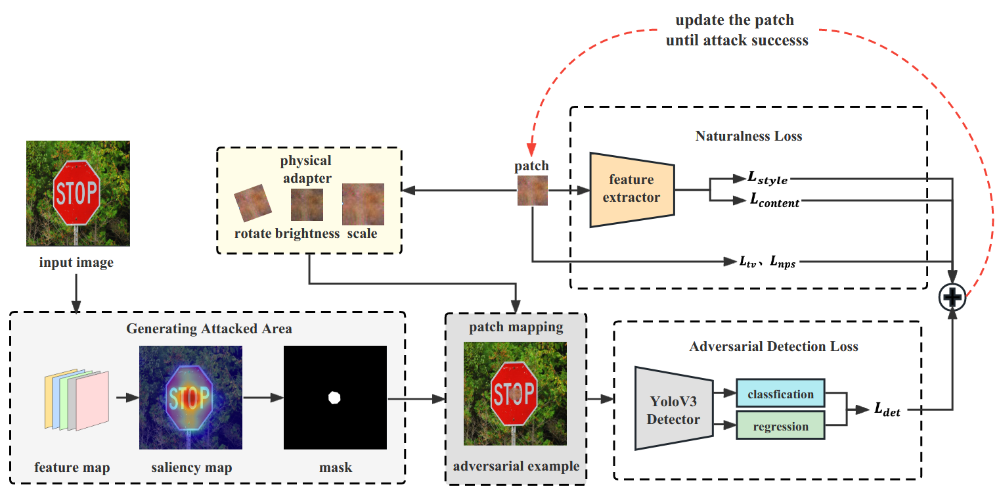

# Rust-Style Patch

Official implementation of "Rust-Style Patch: A Physical and Naturalistic Camouflage Attacks on Object Detector for Remote Sensing Images" by Binyue Deng, Denghui Zhang, Fashan Dong, Junjian Zhang, Muhammad Shafiq and Zhaoquan Gu.

[Paper Link]:(https://www.mdpi.com/2072-4292/15/4/885)

# 热力图生成
yolov3/
- main_gradcam.py
  cls_name 限定交通标识类别
  输出三个检测尺寸的热力图与最后的mask
- models/gradcam.py 生成激活层的函数

# 图像与文件（公用）
- yolov3/data 各种乱七八糟交通标识图片的文件 
- phy/与物理域相关的文件
- style_transfer.py (与风格迁移相关的函数，eg：风格损失和内容损失)
- patch.py（针对补丁相关操作，eg:patchApplier映射函数） 
- PytorchYOLOv3/ 攻击的模型
   - detect.py 主要文件,涉及检测过程中的一些数据处理；DetectorYolov3()返回的数值用于攻击

# 攻击文件（四）
phy_attack.py(物理域攻击)
 - 攻击图像内容路径：content_img_path = f'{yolov3/data/test/}'
 - 攻击图像从211行主函数 main('000000026162.jpg',detectorYolov3)传入
 其他同上
- style_img_path = './yolov3/tie2.jpg' 风格迁移图像
- mask_path = f'-yolov3/outputs/{imgae_name}/mask.jpg'   mask图像
- patch_path = f'{output_adv/patch/{imgae_name}.jpg'   补丁存储路径

